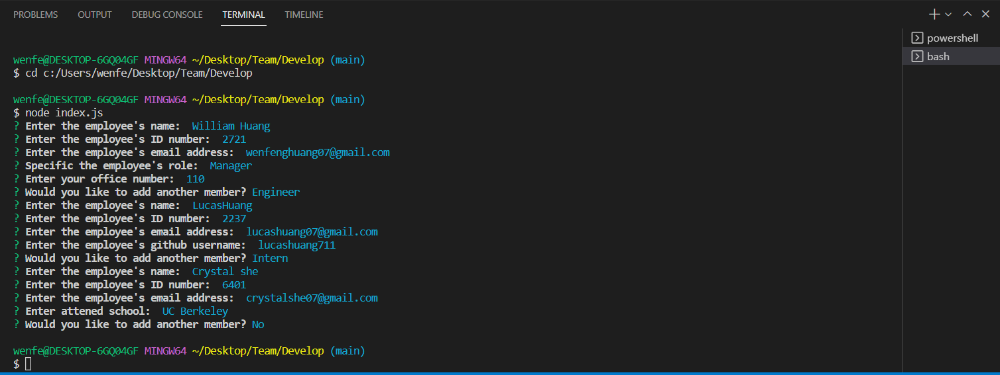
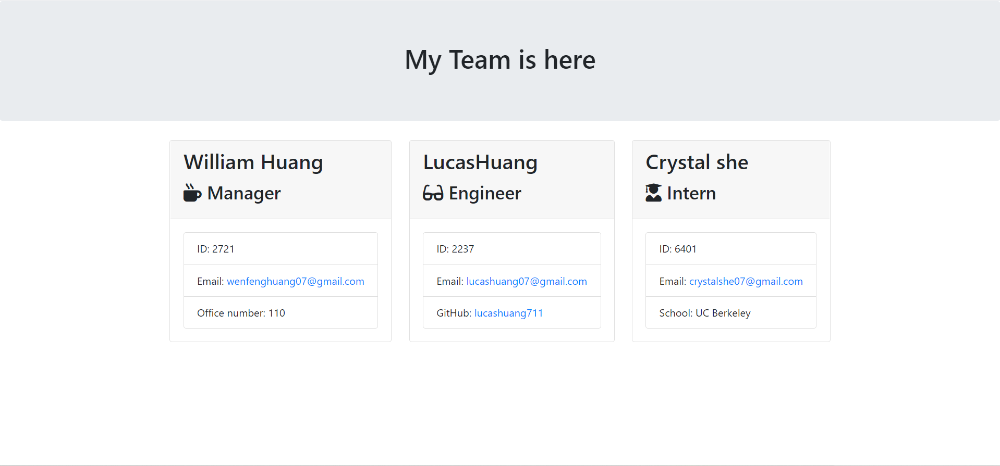

# Team Roster Management Application
    This application is created for generating a team roster including useful information such as email address; and github name. This application would be useful for managing the team.

## Installation
    Before you use this application, implement command "npm install", "npm i inquirer@8.2.4" in GitBash.

## Usage
    Implement command line "node index.js" to start this application

## Mock Up

Below is the output.

## Video Link
    https://drive.google.com/file/d/1HRRBP0T8c66bNOk9QIjwQ3ZrYcY4wjAz/view
